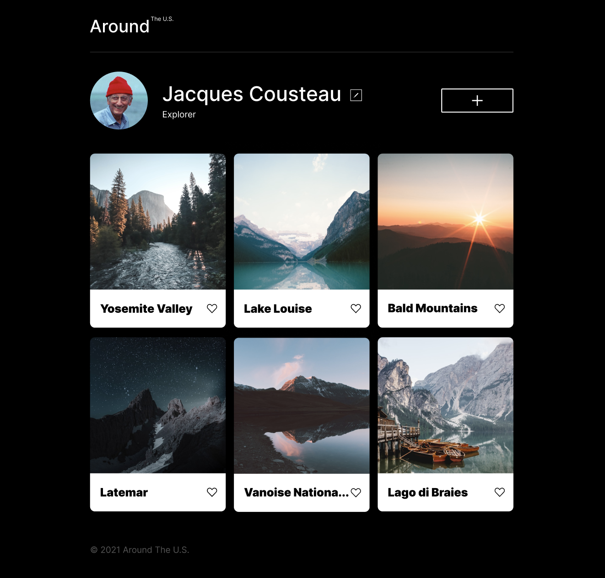

# Project 4: Travel Stories :seedling:

### Practicum by Yandex Web Development Program 2022-2023

### :four_leaf_clover: Overview

- Project Concept
- Project Design
- Project Functionality
- Poject Description
- Project Technologies and Features
- Poject Roadmap
- Project Link (Figma)
- Project Link
- External resources

**:four_leaf_clover: Project Concept**

The concept of this project - travel lovers social media app - is to help people who love to travel create their profile pages where they can upload photos of the places they have visited. The initial design of this project was mainly focused on building a page for travelers across the U.S.

**:four_leaf_clover: Project Design**

The initial project design template provided in Figma had exclusively travel images in one format and design concept. However, in Sprint 5 (description below in Front End Part section) the task was to connect the project to server. Thus the images that are visible since Sprint 5 are received from the server, thus, the images content and design was out of my personal responsibility (those are the images of other student from my study cohort).

Concluding, this leads to mismatch with the inintial design provided to us. However, at that stage of work, it was considered more important for us to learn how to connect our Front End to the server rather than focusing on maintaining the initial design concept of the project.

**:four_leaf_clover: Project Functionality**

The functionality of this project is to build an interactive web page where users can add, remove, or like photos.

**:four_leaf_clover: Project Description**

This project represents a one-page website created using HTML5, CSS3 and JavaScript in compliance with specifications from Figma. The project is build with the technologies which provide responsiveness to all the elements so they are correctly displayed on popular screen sizes (max 1280px - browser, min 320px - mobile). JavaScript is used to add functionality to Form Fields in a Popup Box and save the edited values.

**:four_leaf_clover: Project Technologies and Features**

- HTML5

- CSS3 (including Flexbox, Grid Layout, Media Queries for responsive desing)

- JavaScript (including ES6 Classes)

- Webpack, Postcss, Babel

- API Interaction

- Flat BEM file structure

**:four_leaf_clover: Project Roadmap**

**- Front End Part -**

- Sprint 1 => Create a simple one-page website created using HTML5 and CSS3. Add responsiveness (max 1280px -> browser, min 320px -> mobile). "Edit Profile" popup form created (input text values - "name", "about me", save-button and close-button). Users are able now to edit their profile data.

- Sprint 2 => Add "Add Card" popup form (input text values - "title", "image link", create-button and close-button). Users are able now to add a new image card to the existing ones. Added delete-button with functionality to delete a card. Added functionality to "like" the images by clicking on heart-icon (when clicked - it changes color from transparent to black).

- Sprint 3 => Add validation to all popup forms. Add functionality to close popups by clicking outside popup form and pressing "Escape" button.

- Sprint 4 => Refactor code according to Object Oriented Programming main principles:

1. Create Card class (which creates a card with text and an image link) and FormValidator class (which sets settings for validating form fields), create an instance of the FormValidator class for each form that should be validated.

2. Divide the JavaScript code into modules: Card.js contains the code of the Card class, FormValidator.js contains the code of the FormValidator class, utils.js contains the event handlers and the function that opens/closes modal windows, index.js contains the rest of the code.

- Sprint 5 => Connect website to server. Deploy project build to GitHub Pages (using Webpack).

**- Back End Part -**

In the future Sprints more functionality will be added.

**:four_leaf_clover: Project Link (Figma) - initial design**

- [Project Link in Figma](https://www.figma.com/file/SurN1jaeEQIhuZEDMhmWWf/Sprint-4-Around-The-U.S.-desktop-mobile?node-id=0%3A1)

**:four_leaf_clover: Project Link**

- [Project Link](https://mariakonstantinov.github.io/web_project_4/)

**:four_leaf_clover: External resources**

- [Photos Resource](https://www.pinterest.com/)
